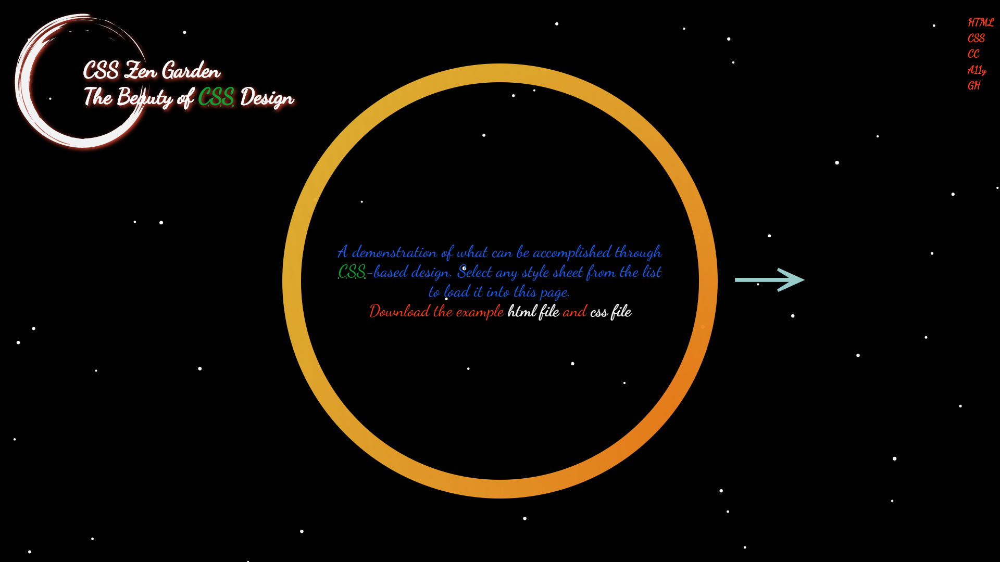
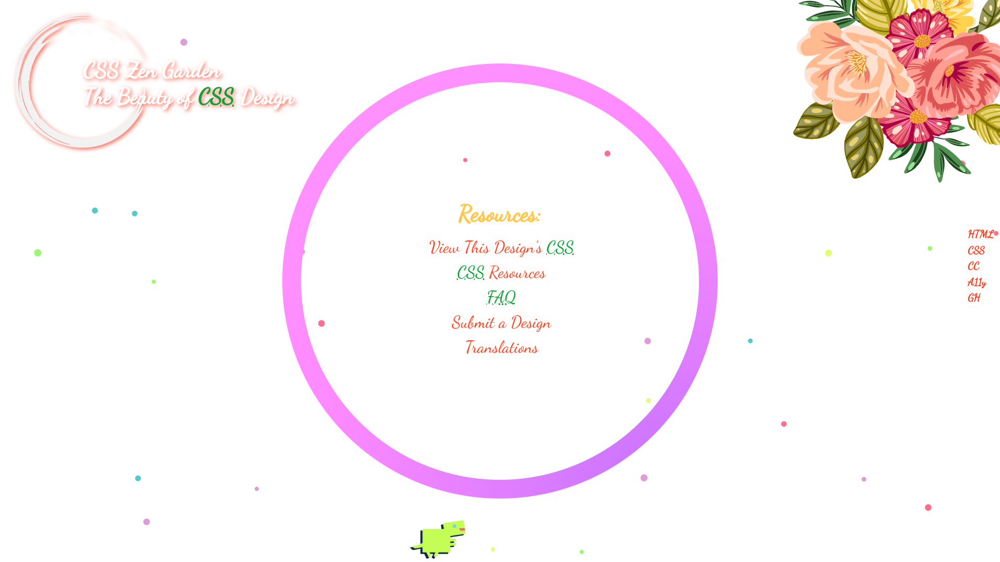

# CSS Zen-Garden CSS美化練習
網站：https://ya95123.github.io/css-zen-garden/

### 設計說明
想呈現一種"試煉感"。  
學習的路上或許起頭很難，或是還找不到方向，  
不過堅持到底，有一天它已漸漸成為你生命中的一部份，
而且越來越明亮，甚至它以為你鋪出了下一條美好的路。

所以顏色才會從暗色，直至文字內容讀完時，轉變成明亮色。
喻意為「堅持到底，將得勝利」。

最後小恐龍的出現，是希望他能夠為你慶賀，
點擊它，畫面會再度回到暗色，這並不是說你再回到過去痛苦的日子，
而是你回頭看你能更加明白從前那些，日子。
再跳回最後一頁，仍會轉回亮色，即為"此刻的明亮"。

### 畫面1(暗色)

### 畫面2(明亮)

